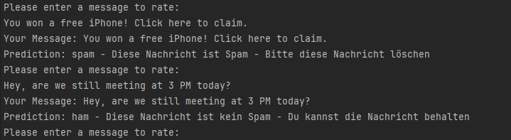

**Projekt ONNXBayes**

In diesem Projekt wird gezeigt, wie ein trainiertes Naive-Bayes-Modell aus Python mit ONNX exportiert und anschließend in C# ausgeführt werden kann.

Das Ziel ist, Python-ML-Modelle plattformübergreifend nutzbar zu machen, sodass Vorhersagen direkt in einer C#-Anwendung erfolgen können.

Für dieses Beispiel wurde das ML-Modell aus meinem vorherigen Projekt verwendet: [Spamfilter-Naive-Bayes](https://github.com/Juljano/Spamfilter-Naive-Bayes)

**ML-Modell läuft mit ONNX in ein C#-Programm**

